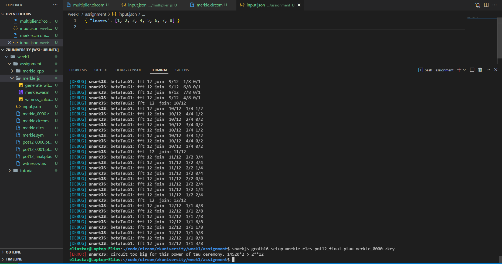
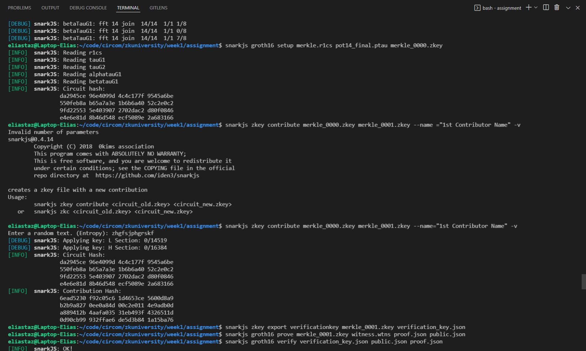
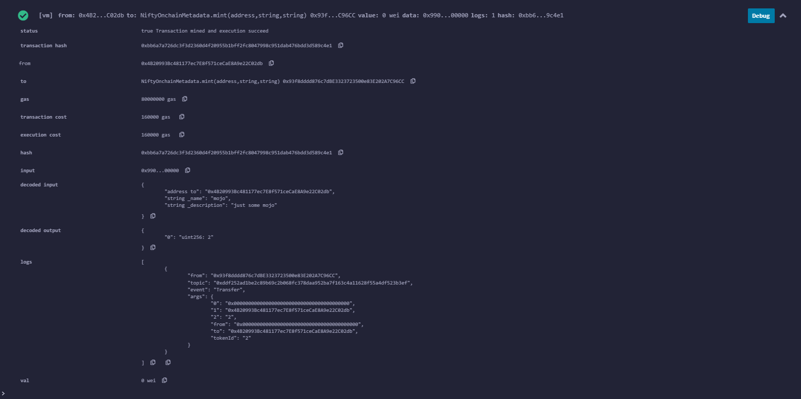

# Welcome to zkUniversity's first week assignment.

## Q1

### Q1.1

Check out merkle.circom !

### Q1.2

Upon trying to generate phase 2 of trusted setup, encountered an error:

I fixed the error by using powers of tau: 14. ` 2**14 = 16,384` Which is bigger than the value we obtain in the error, ~14K.

Here is a screenshot of the execution.

### Q1.3

#### Do we really need zkProofs for this?

Well, not really! Here, we are constructing a merkle root using initial leaves as public inputs. Many different programming languages could construct a merkle root using leaves as parameters.
A smart contract like <a href="https://solidity-by-example.org/app/merkle-tree/"> this </a> could achieves a similar thing as it verifies if a leaf is inside a merkle tree using a merkle root and some well-chosen tree nodes.

My only guess is that it must cost a lot of gas, meaning that on congested network, it might be expensive to create a merkle tree such as Ethereum.

#### Are there any technologies implementing this type of proof?

I guess zkRollups are somehow close to this: many transactions (leaves) are bundled up together and submitted on an L1 for a verifier contract to verify that they are valid.

## Q2

### Q2.1

Check out the solidity folder :)!

### Q2.2

Check out the Merkle structure of the NiftyOnchainMetadata.sol

### Q2.3

Here are some minting transactions !

## Q3

### Q3.1

The main differences between SNARKs and STARKs are mainly :

- The algorithmic complexity of the prover and verifier process.
- The proof size
- The existence of a verification key stemming from the trusted setup ceremony, as well as the existence of a trusted setup itself.
- STARKs are quantum secure, as they rely on hash algorithms as opposed to elliptic curves-based SNARKs.

From a practical perspective, when using STARKs, we don't need to run a trusted setup process, i.e., no powers of tau ceremony!
As a result, we don't need to manipulate a .zkey file for verification and proof generation.

I don't believe prover time nor verification time differences are noticeable for STARKs vs. SNARKs.

### Q3.2

#### How is the trusted setup process different between Groth16 and PLONK?

### Q3.3

#### Give an idea of how we can apply ZK to create unique usage for NFTs.

We could create a secret "minting club" for some NFT collection, whereby some NFTs are initially minted and the receivers are recorded in a zkProof as part of a merkle tree. If the NFT is sold, it looses some sense of value, as the new receiver cannot prove that they were part of the minting process.

#### Give an idea for DAO tooling with ZKP.

We could apply the idea stated above to DAO tooling. Participants would mint an NFT to be a part of a DAO voting process, but when the NFT is exchanged (sold or given), it looses voting power and just becomes a cosmetic item.
