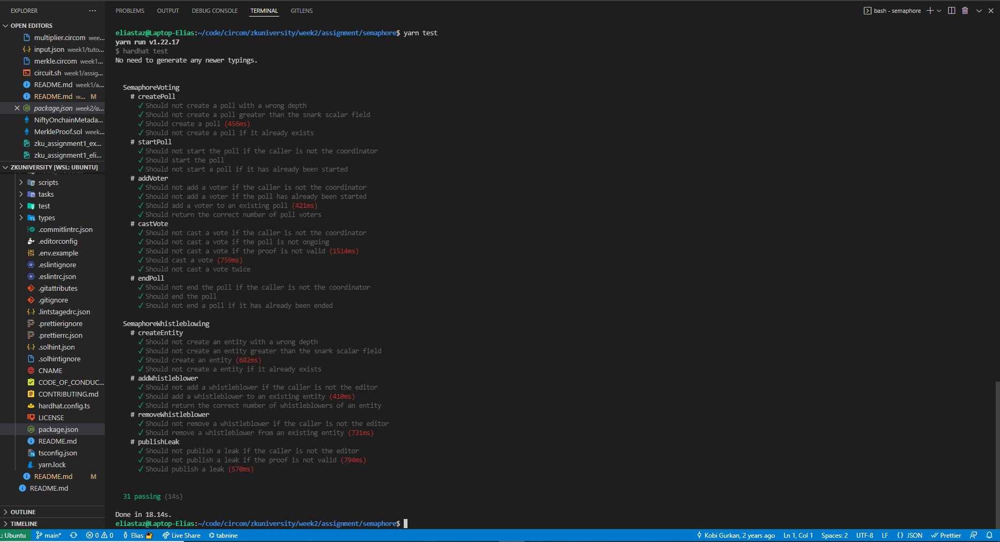
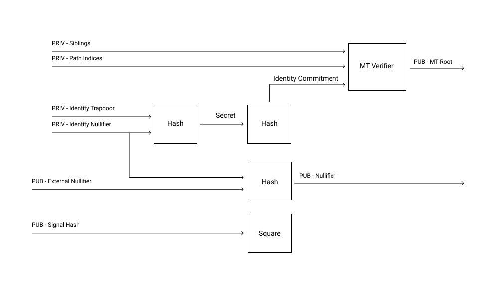
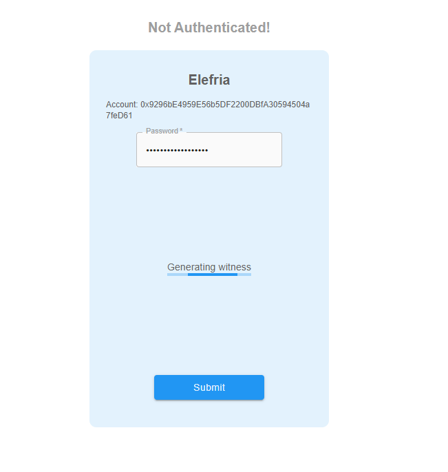
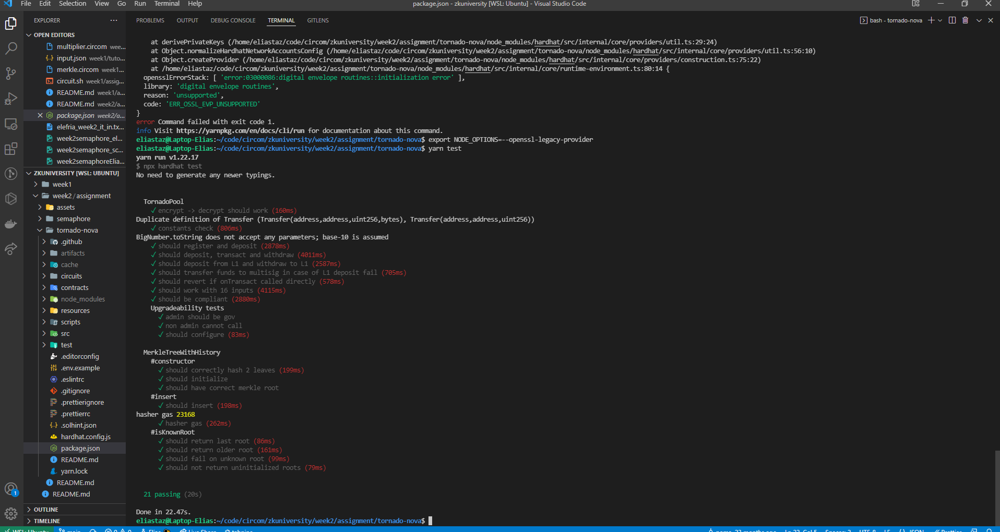
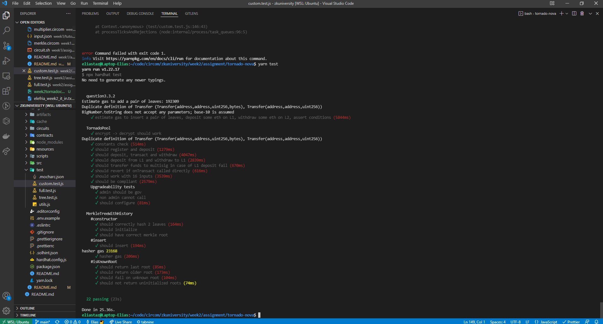

## :rocket: :rocket: Welcome to Assignment no. 2, week 2 of zkUniversity, by Harmony One. I'm Elias, and this is my attempt at this challenge. :rocket: :rocket:

---

## Question 1: Privacy & ZK VMs

### Q1.1: Explain in brief, how does the existing blockchain state transition to a new state?

As explained in the [zCloak Network overview](https://zcloaknetwork.medium.com/zcloak-network-a-technical-overview-254e59a8d1c2), present blockchains grab inputs in the form of a transaction and depending on some pre-defined rules, change the general state. This process is replicated accross all distributed nodes by re-execution of the State Transtion Function (STF).
We get:
`STF(current_state, input_data) = new_state`

With verification over re-execution, you get the following advantages:

- Privacy: Users might not want to expose their input data y as part of the STF(x, y) computation. Some zkVM allow for enhanced user privacy. If I remember correctly though, in Polygon Hermez, the state as well as user inputs are public when performing zkRollups, therefore privacy is optional in this case. Someone creating a zkVM can choose to make these input data private or not.
  Note: I believe as of this moment (March 11th 2022) Polygon Hermez does not have a zkVM in mainnet, but in preparation.

- Scalability: re-execution is extremely computationally expensive for nodes accross a network. Verification would free up a lot of computation usage.

- Computation restriction: One could compute something extremely costly off-chain and submit on-chain the "proof of computation", i.e. a ZKP proving that the calculation is correct and genuine.

- Storage: If a node could boot up using the latest state of the network and a proof that this state results from the full history of the blockchain, then the community could circumvent the risk of excluding smaller nodes from the network.

---

### Q1.2: Explain in brief what is a ZK VM (virtual machine) and how it works?

The simplest definition I found is the following, from [Koh Wei Jie](https://medium.com/zeroknowledge/zero-knowledge-virtual-machines-the-polaris-license-and-vendor-lock-in-ab2c631cf139):

> A ZK VM is a circuit that executes bytecode. It allows a prover to show that, given a set of inputs, as well as some bytecode, they have correctly executed the program code on said inputs.

Here is a schema explaining zkVM, taken from [Bobbin Threadbare](https://ethresear.ch/t/a-sketch-for-a-stark-based-vm/7048).


It is important to note, for clarity's sake, that:

> Notably, the bytecode (or program) is not the circuit itself, but part of its inputs. As such, a prover can use the same circuit to create proofs of validity of execution for arbitrary programs, as long as said programs fit the underlying ZK VM circuit.

#### Q1.2.1: Give examples of certain projects building Zk VMs

| zkVM       | Architecture          | Language              | Type of zkp | Corporation / Foundation | Language support     | Functional / data Privacy |
| ---------- | --------------------- | --------------------- | ----------- | ------------------------ | -------------------- | ------------------------- |
| Miden VM   | Upgrade of Distaff VM | Rust + assembly-like  | zk-Stark    | Polygon                  | Solidity, Move, Sway | Soon (WIP                 |
| Distaff VM | Distaff VM            | Rust + assembly-like  | zk-Stark    | zCloak (GuildOfWeavers)  | Distaff Instructions | N/A                       |
| Cairo VM   | Cairo VM              | Cairo (assembly-like) | zk-Stark    | Starkware                | Cairo                | Yes                       |

### Q1.2.2: What are the advantages and disadvantages of some of the existing Zk VMs?

- ➖ Entrusting a zkVM to go from custom programming language => circuits (and if needed trusted setups) + proofs means that there is now a single point of failure in this technology. This can also be an advantage if the zkVM is well audited, this saves individual circom circuits to be faulty. This is a one size fits all vs. many smaller programs dilemna.
- ➖ There might be some kind of vendor lock-in.
- ➖ It could be that writing in a user-friendly language such as circom is as practicable (if not more) as writing in some custom assembly-like zkVM language.

- ➕ It can offer a better user experience: you don't have to worry about ceremony of ptau, circuits coding, proof generation or anything and enjoy security of ZKP.

---

## Question 1: Semaphore

### Question 2.1: What is Semaphore?

As per [Semaphore's ](https://github.com/appliedzkp/semaphore) definition:

> Semaphore is a zero-knowledge gadget which allows Ethereum users to prove their membership of a set without revealing their original identity. At the same time, it allows users to signal their endorsement of an arbitrary string. It is designed to be a simple and generic privacy layer for Ethereum DApps. Use cases include private voting, whistleblowing, mixers, and anonymous authentication.

In my own words, I view it as a way to authentify yourself privately and do something. This can range from anonymous voting and whistleblowing as mentioned above, to tools that enable your transactions to be untraceable and anonymous.

### Question 2.2: Clone the semaphore repo

#### Question 2.2.1: Run the tests

Note for anyone: I had to run `yarn hardhat typechain` before being able to run tests.
Got the following CLI message when running `yarn test` without the above mentioned command:

> test/SemaphoreVoting.ts:6:33 - error TS2307: Cannot find module '../build/typechain' or its corresponding type declarations.
> 6 import { SemaphoreVoting } from "../build/typechain"

Got the following CLI messsage after running it:

> Generating typings for: 0 artifacts in dir: ./build/typechain for target: ethers-v5
> Successfully generated 29 typings!

Here is a screenshot of all the tests running.



#### Question 2.2.2

For clarity, here's a scheme of how the [circuit](https://github.com/appliedzkp/semaphore/blob/3bce72febeba48454cb618a1f690045c04809900/circuits/scheme.png) works.



Here, we reproduce the file's code template per template. You can otherwise find it [here](https://github.com/appliedzkp/semaphore/blob/3bce72febeba48454cb618a1f690045c04809900/circuits/semaphore.circom) at the commit hash 3bce72f.

The template `CalculateSecret()` is aimed at generating a secret for the user. The hash of both the identityNullifier and the identity trapdoor will produce this secret. These two inputs are two random secrets that only the user knows and sends to the circuit as private inputs.

```
template CalculateSecret() {
    signal input identityNullifier;
    signal input identityTrapdoor;

    signal output out;

    component poseidon = Poseidon(2);

    poseidon.inputs[0] <== identityNullifier;
    poseidon.inputs[1] <== identityTrapdoor;

    out <== poseidon.out;
}
```

The template `CalculateIdentityCommitment()` is aimed at generating the user's identity commitment. It is simply the poseidon hash of the poseidon digest of the two secrets aforementioned (IT and IN). That is: `Poseidon(Poseidon(IT, IN))`

```
template CalculateIdentityCommitment() {
    signal input secret;

    signal output out;

    component poseidon = Poseidon(1);

    poseidon.inputs[0] <== secret;

    out <== poseidon.out;
}
```

The template `CalculateNullifierHash()` takes in the external nullifier (that prevents double calling/ re-entrancy) and the identity nullifier (user secret) to form a public nullifier.

```
template CalculateNullifierHash() {
    signal input externalNullifier;
    signal input identityNullifier;

    signal output out;

    component poseidon = Poseidon(2);

    poseidon.inputs[0] <== externalNullifier;
    poseidon.inputs[1] <== identityNullifier;

    out <== poseidon.out;
}
```

This is the main template. `Semaphore(nLevels)` will include the other templates and enforce the structure shown in the schema above. The external nullifier is a public input (I believe it works kind of like a nonce, or a one time validation string to prove you are not submitting twice). The treePathIndices and treeSiblings are variables that will be used to update the merkle tree and include the output of the `CalculateIdentityCommitment` template.
The user's indentity commitment is thus commited to the merkle tree, the `inclusionProof.leaf` binds it to the merkle tree, a new merkle root is produced. The user can now be authentified safely and securely.
`signalHashSquared` is meant to prevent signal tampering through squaring the signaHash itself. I'm not too sure how signal tampering takes place.

```

// nLevels must be < 32.
template Semaphore(nLevels) {
    signal input identityNullifier;
    signal input identityTrapdoor;
    signal input treePathIndices[nLevels];
    signal input treeSiblings[nLevels];

    signal input signalHash;
    signal input externalNullifier;

    signal output root;
    signal output nullifierHash;

    component calculateSecret = CalculateSecret();
    calculateSecret.identityNullifier <== identityNullifier;
    calculateSecret.identityTrapdoor <== identityTrapdoor;

    signal secret;
    secret <== calculateSecret.out;

    component calculateIdentityCommitment = CalculateIdentityCommitment();
    calculateIdentityCommitment.secret <== secret;

    component calculateNullifierHash = CalculateNullifierHash();
    calculateNullifierHash.externalNullifier <== externalNullifier;
    calculateNullifierHash.identityNullifier <== identityNullifier;

    component inclusionProof = MerkleTreeInclusionProof(nLevels);
    inclusionProof.leaf <== calculateIdentityCommitment.out;

    for (var i = 0; i < nLevels; i++) {
        inclusionProof.siblings[i] <== treeSiblings[i];
        inclusionProof.pathIndices[i] <== treePathIndices[i];
    }

    root <== inclusionProof.root;

    // Dummy square to prevent tampering signalHash.
    signal signalHashSquared;
    signalHashSquared <== signalHash * signalHash;

    nullifierHash <== calculateNullifierHash.out;
}
```

```

component main {public [signalHash, externalNullifier]} = Semaphore(20);
```

### Question 2.3: Use Elefria protocol on the Harmony Testnet

#### Question 2.3.1: What potential challenges are there to overcome in such an authentication system?

In my experience, the time to generate a witness was very long.
Moreover, saving a password, as well as 2 random secrets can really be a pain for end user. This approach creates a lot of user friction for UX.



---

## Question 3: Tornado Cash

### Question 3.1

It appears former [Tornado pools](https://github.com/tornadocash/tornado-trees) allowed a per poor fixed amount of deposit/withdrawal. As of Tornado Cash [Nova](https://github.com/tornadocash/tornado-nova), users can deposit and withdraw arbitrary amounts inside the tornado cash pools.

Note: At the time of the [article](https://tornado-cash.medium.com/tornado-cash-introduces-arbitrary-amounts-shielded-transfers-8df92d93c37c), these pools are in beta and max amount of deposit is 1 ETH.

Users can now do shielded transfers within the pool without having to withdraw and re-deposit. Thus, they can do intrapool transactions.

Tornado Cash Nova chose Gnosis Chain (former xDai) as L2 for their low gas fees, fast withdrawal time (minutes). They utilize under the hood the ETH <> WETH L2 Gnosis Bridge. Users might therefore consider the risk of using Tornado Cash to be slightly increased: from only zk-proof technology risk (greenness of the tech) to now bridge technology risk on top of it. Nonetheless, this is an acceptable risk as this bridge is part of the major bridges and has been audited.

### Question 3.2

#### Question 3.2.1

Here is the circuit: [circuits/TreeUpdateArgsHasher.circom](https://github.com/tornadocash/tornado-trees/blob/master/circuits/TreeUpdateArgsHasher.circom).

See the smart contract: [contracts/TornadoTrees.sol](https://github.com/tornadocash/tornado-trees/blob/master/contracts/TornadoTrees.sol)

Clarifications to help understand the underlying structure:

- elements to be added to merkle tree: information relevant to the users' action (deposit, withdrawal, transaction);
- Tornado Cash's priorities are privacy and gas optimization. They will use as many smart and crafty operations to reduce gas usage.
- Although elements that are added to the merkle tree are not included in the EVM side as storage, they are included as calldata (16 gas vs. 625 gas per byte of data).

Tornado Cash uses zkSnarks for its compression capabilities and privacy enabling.
Tornado Cash uses an updatable merkle tree to upload an array of authorized users to the blockchain. These users are stored in a merkle root and will then be able to withdraw some amount off a pool. The zkSnarks are used to do the computation offchain in order to save gas, and prove onchain the correctness of the elements added.

The circom circuit will pack all the elements and hash them using sha256.

#### How does it work?

1. User constructs the proof (.circom related files) of their elements being added to the Tornado pool (merkle tree).

2. Call is made to the smart contract (.sol, EVM related process) where the proof is submitted onchain, the elements are submitted as call-data and packed as bytes and then rechecked. Then, checks are made to see that everything matches and correctness of the submitted elements.

3. User is successfully added to withdrawal tree.

Note: All the SNARK public inputs are hashed together to be submitted as only one public input to the verifier. This is aimed at minimize elliptic curve computations, thus saving a lot of gas. The tradeoff is to have more computation on the SNARK side.

#### Question 3.2.2: Why do you think we use the SHA256 hash here instead of the Poseidon hash used elsewhere?

Here is the situation at hand: SHA256 relatively light gas-wise on the EVM, but on-chain Poseidon is very expensive. On the contrary, SHA256 is very expensive on circom and Poseidon isn't. Since Tornado wants to save money through gas optimization, they chose to put the computation pressure on the side of SNARK building.

### Question 3.3

#### Question 3.3.1

Here is a screenshot of the tests passing.



#### Question 3.3.2

See [tornado](./tornado-nova/test/custom.test.js)



## Question 4

### Question 4.1: If you have a chance to meet with the people who built Tornado Cash & Semaphore, what questions would you ask them about their protocols?

Hi guys! First of, I just want to thank you. This has been really an amazing journey and I appreciate how hard this must've been. Congrats!
I'd like to ask how you see the expansion of zkVMs and in a larger sense the opposition between Blockchain specifically designed for zk-enabled apps (mixers, voting, privacy, anything zkStark / zkSnark friendly) vs. application specifically designed for zk-proofs but on general purpose blockchains such as Ethereum and others.
