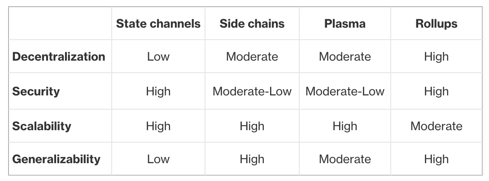
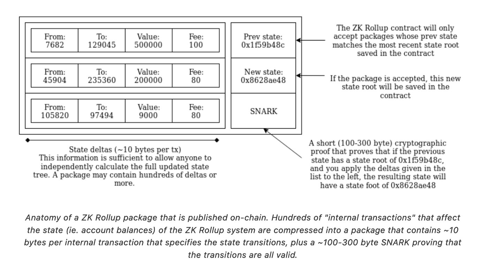

# Week 4 - Assignment 4 

Welcome 😊😊! Good to see you again.

## Question 1: Scaling the future

### Question 1.1. 

| Solution / Characteristic | Need to join | Capital inefficient   | Reliant on trusted watcher/relayer                                                         | Relationship to the main chain      | Fast                                                 | Cheap                                                          |
|---------------------------|--------------|-----------------------|--------------------------------------------------------------------------------------------|-------------------------------------|------------------------------------------------------|----------------------------------------------------------------|
| Payment channels          | Yes          | Yes (locking amounts) | Yes                                                                                        | Settlement on main chain            | Yes                                                  | Very cheap (only transact on-chain 2 times: to enter and exit) |
| Sidechains                | No           | No                    | Not really (usually just a validator set)                                                  | Bridge from and to main chain       | Yes                                                  | Depends but mostly                                             |
| Plasma                    | Yes          | No                    | Yes, an operator to commit data as merkle root                                             | Commit merkle root                  | No, challenge periods are very long (7 days approx.) | Yes                                                            |
| Optimistic Rollups        | No           | No                    | Yes                                                                                        | Commit batching of state transition | Yes, very (if not fastest, but only for processing, not withdrawals)                           | Yes                                                            |
| ZK Rollups                | No           | No                    | No, only reliant on proper setup (correct trusted setup for SNARKs, transparent for STARK) | Commit zkproof of state transition  | Yes, very                                            | Yes                                                            |


It feels as though main problems for Plasma approach are: data availability (i.e. an operator withholding the merkle root to block people's freedom to move funds) and delay to withdraw.

Here's a small comparison table from [Preethi Kasireddy](https://www.preethikasireddy.com/post/a-normies-guide-to-rollups) to conclude this question.



### Question 1.2

Here's a schema I found on [vitalik's blog](vitalik.ca).



I understand the following points from it:

1. A smart contract deployed on Ethereum represents the rollup's on-chain state. It has the balances of accounts present on the L2.
2. Transactions' computation is done off-chain. Only the proof and the state delta needs to be submitted to update the state of the smart contract.
3. This smart contract on L1 stores the merkle root of its present global state.
4. Producing a new block consists in submitting a new batch, containing: state delta (works like a [clearing house](https://en.wikipedia.org/wiki/Clearing_house_(finance))), current merkle root to verify that this batch corresponds to the current sate of the L2 rollup and a SNARK proof (this zkp proves that the state delta is correct).

Note: it appears to me that L2 zkrollups cannot simply store the bytecode of EVM smart contracts inside the zkrollup smart contract deployed on the L1 chain. I think this way because I read zkVMs aren't able to simply execute EVM op-codes - or at least it isn't that simple. That being said, I read many projects are moving towards full EVM compatibility (zkSync v2 in alpha, Polygon's zkVM by Jordi Baylina and Eduardo Antuna's team, etc.).

The major pros I can see are:
- Considering SNARK's constant size, if state delta does not grow too much (which it shouldn't), a zkrollup can scale and keep decent gas costs for batch commits.
- The zk aspect allows for fast withdrawals, hence beating optimistic rollup to it. One could argue that the market for fast withdrawal (buying out for a small price the right to withdraw instantly and offset the risk and awaiting time to someone else) is growing but it does not mitigate the risk of malicious activity.
- The gas costs are still higher than optimistic rollups for on-chain commitment of batches. There is probably no way to reduce them more efficiently as is.
- For general purpose L2s, I believe zkrollups are inherently better than payment channels (for bidirectional, not general purpose use) and plasma chains (long challenge times).

Here's an interesting quote I read from a [Matter Labs' founder blog post](https://blog.matter-labs.io/zkrollup-vs-validium-starkex-5614e38bc263):

> How it works: for every zkRollup block, information required to reconstruct the changes in the state must be submitted as call-data of the Ethereum transaction — otherwise the zkRollup smart contract will refuse to make the state transition. State changes on zkRollups incurs a small gas cost per transaction which grows linearly with the number of transactions.
> With the Merkle tree data at hand, users who are being censored always have the ability to claim their funds directly from the zkRollup contract on the mainnet. All they need to do is to provide a Merkle proof of ownership on their account. Thus, on-chain data availability serves as a guarantee that nobody (including zkRollup operators) can freeze nor capture users’ funds.

From this I can tell that the data availability problem is solved for users of zkrollups, but that this limits the solution's throughput.

### Question 1.3

As stated in the question, the EVM is a big state machine. Its interaction with blocks can be represented as follows, with `stf` being the state transition function:
```
stf(current_state, block) = new_state
````

For Ethereum, running a full node (as opposed to stateless) has become very complex: heavy, a lot of computation, order is important so it's longer to bootstrap a node.

A stateless client solves this issue by changing the parameters needed to validate a new state:

```
stf(current_state_merkle_root, block, witness) = new_state_root
```

Firstly, this allows for actual validation and does not require any form of so-called optimism. Moreover, out of order validation is also made possible and might come in handy for fast bootstrap of nodes in the event of shard reshuffling (Eth2.0 sharding phase). The witness is used as a proof that the updated merkle root is a result of the block's change in state. 

Nevertheless, the part of the state that is read and updated needs to be posted as a part of the witness. This means that several merkle branches need to be committed as part of the new block validation. There is a need for even lighter (in terms of bytes size) clients. There comes zero-knowledge proofs.

A stateless node can be correct in its validation with the following parameters: 
1. the merkle root of the current state,
2. the new block 
3. a zero-knowledge proof that proves the new state root is a result of updating the current state merkle tree with the new block's information.

In conclusion: zero-knowledge proofs improve on the stateless client concept as they allow for a fully stateless validation process. Without zero-knowledge technology (or polynomial commitments), the state transition function in a stateless client has to incorporate a "semi-stateful" witness (i.e. parts of the state that is read and modified). By providing only current and future merkle root of the state, the new block and a zero-knowledge proof, nodes can now simply verify zero-knowledge proofs and expect that the proof will return *true*, if and only if the new block is valid.
